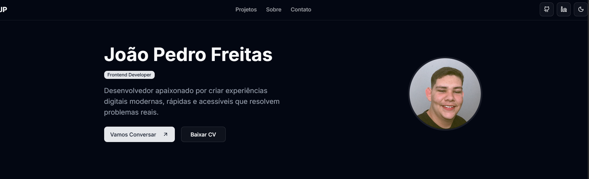

# Portfólio Pessoal - João Pedro Freitas

    

Este é o repositório do meu portfólio pessoal, uma aplicação web moderna e totalmente responsiva onde apresento minhas habilidades, projetos e formação. O objetivo é servir como um cartão de visitas digital para recrutadores e para a comunidade de desenvolvimento.

**[Acesse a versão ao vivo aqui!](https://portfolio-joaopedrofreitas.vercel.app/)** ---

## 📸 Screenshot



---

## ✨ Funcionalidades

O portfólio foi construído com foco na experiência do usuário e em um design limpo, apresentando as seguintes funcionalidades:

* **Tema Dark/Light:** Alternância de tema suave com `next-themes`, respeitando a preferência do sistema do usuário.
* **Totalmente Responsivo:** Layout adaptável para uma ótima experiência em desktops, tablets e celulares.
* **Seções Dinâmicas:**
    * **Projetos:** Exibição dos meus principais trabalhos, com links para o repositório no GitHub e para a versão ao vivo.
    * **Sobre Mim:** Uma breve introdução sobre minha jornada e paixão por desenvolvimento.
    * **Habilidades:** Listagem das minhas principais competências técnicas.
    * **Formação e Cursos:** Detalhes sobre minha formação acadêmica e cursos complementares.
    * **Contato:** Formulário funcional para envio de mensagens.
* **Animações Modernas:** Animações sutis de entrada e hover utilizando `Framer Motion` para uma navegação mais fluida e agradável.
* **Navegação Suave:** Header fixo com links que rolam suavemente para as seções correspondentes.
* **Download de CV:** Botão para baixar meu currículo diretamente do site.

---

Claro, aqui está a seção formatada exatamente como você pediu:

---

### 🚀 Tecnologias Utilizadas

Este projeto foi desenvolvido utilizando as seguintes tecnologias e ferramentas:

* **Framework:** [Next.js](https://nextjs.org/)
* **Linguagem:** [TypeScript](https://www.typescriptlang.org/)
* **Estilização:** [Tailwind CSS](https://tailwindcss.com/)
* **Biblioteca de Componentes:** [shadcn/ui](https://ui.shadcn.com/)
* **Animações:** [Framer Motion](https://www.framer.com/motion/)
* **Ícones:** [Lucide React](https://lucide.dev/)
* **Notificações (Toast):** [Sonner](https://sonner.emilkowal.ski/)
* **Envio de E-mail:** [EmailJS](https://www.emailjs.com/)
* **Gerenciamento de Tema:** [next-themes](https://github.com/pacocoursey/next-themes)
* **Versionamento:** [Git](https://git-scm.com/) & [GitHub](https://github.com)
---

## 🛠️ Como Executar o Projeto Localmente

Siga os passos abaixo para rodar o projeto na sua máquina.

**Pré-requisitos:**
* [Node.js](https://nodejs.org/en/) (versão 18 ou superior)
* [Git](https://git-scm.com/)

```bash
# 1. Clone este repositório
git clone [https://github.com/JoaoPedroFreitas9/My-Portfolio.git](https://github.com/JoaoPedroFreitas9/My-Portfolio.git)

# 2. Navegue até a pasta do projeto
cd My-Portfolio

# 3. Instale as dependências
npm install

# 4. Rode o servidor de desenvolvimento
npm run dev
